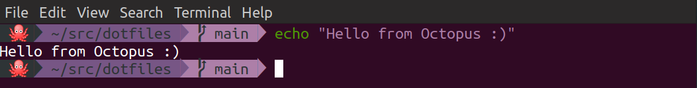

# dotfiles



```
$ git clone https://github.com/alena-bartosh/dotfiles.git
$ cd dotfiles
```

### Git

```
$ scripts/setup_git.sh
```

### Oh My Steps

```
$ scripts/install_zsh.sh
$ scripts/setup_ohmyzsh.sh
```

### Code conduction

* Use [Gitmoji](https://gitmoji.carloscuesta.me) for commit messages
